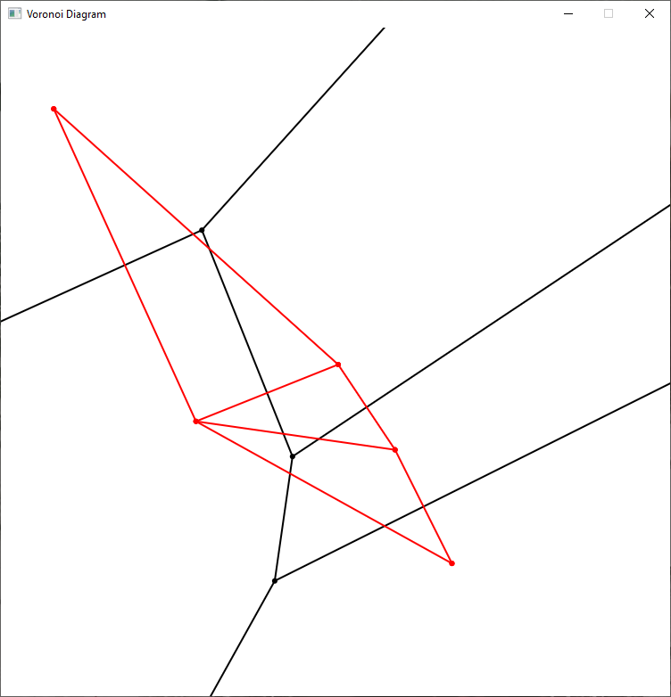

# Voronoi-Diagram
## About
This is a project for COM S 418: Computational Geometry. Given any number of points, it will generate the Voronoi diagram of the points using Steven Fortune's line sweep algorithm. It will also generate the Delaunay triangulation of the set of site points using the Voronoi diagram.

### Notes
The code does not currently handle the case in which a site point appears directly below a breakpoint that is tracing a vertical edge. This is due to an issue with incorrectly removing and adding breakpoints in this case. The code may throw a `NullPointerException` in this case.

Additionaly, there is an issue where, with some input sets, the code will get stuck in an infinite loop during the calculation of the Voronoi cells. This is also due to incorrectly removing breakpoints. If the code fails to complete in a reasonable amount of time, this is likely the cause.

## Input
The input file must contain (x, y) coordinate pairs separated by either a space or a newline. These coordinates can be decimals. The input file may also contain blank lines and comments can be added using the '#' character.
### Example
```
# Example Site Points
# Note the comments and the blank line

(2, -3) (-10, 9) (0, 0)
(-5, -2) (4, -7)
```

## Output
### Text
The output of the program is written to the file `voronoi.txt`, which will be placed in the project's base directory. The Voronoi digram will be printed first, followed by the Delaunay triangulation. For each, the vertices of the doubly-connected edge list will be printed, followed by the faces, followed by the edges.

* A vertex is printed as `Name  Coordinates  IncidentEdge`.
* A face is printed as `Name  InnerComponent OuterComponents`.
* An edge is printed as `Name  Origin  Twin  IncidentFace  Next  Previous`
#### Example
This is the textual output using the example site points
```
****** Voronoi Diagram ******
v1  (-4.7923, 4.7308)  e1,2
v2  (-1.6053, -3.2368)  e2,3
v3  (-2.2308, -7.6154)  e3,b6
b1  (-24.7923, -27.6154)  eb1,b7
b2  (18.3947, -27.6154)  eb2,b6
b3  (18.3947, 24.7308)  eb3,b9
b4  (-24.7923, 24.7308)  eb4,b8
b5  (18.3947, 2.6974)  eb5,3
b6  (-13.3419, -27.6154)  eb6,3
b7  (-24.7923, -4.3601)  eb7,1
b8  (13.2077, 24.7308)  eb8,1
b9  (18.3947, 10.0965)  eb9,2


uf  nil  eb2,b6
c2  eb7,1  nil
c3  e2,b9  nil
c4  e1,b7  nil
c1  e3,b5  nil
c5  eb5,3  nil


e1,b8  v1  eb8,1  c2  eb8,b4  eb7,1
eb8,1  b8  e1,b8  c3  e1,2  eb3,b8
eb7,1  b7  e1,b7  c2  e1,b8  eb4,b7
e1,b7  v1  eb7,1  c4  eb7,b1  e2,1
e2,1  v2  e1,2  c4  e1,b7  e3,2
e1,2  v1  e2,1  c3  e2,b9  eb8,1
e2,b9  v2  eb9,2  c3  eb9,b3  e1,2
eb9,2  b9  e2,b9  c1  e2,3  eb5,b9
e3,2  v3  e2,3  c4  e2,1  eb6,3
e2,3  v2  e3,2  c1  e3,b5  eb9,2
e3,b5  v3  eb5,3  c1  eb5,b9  e2,3
eb5,3  b5  e3,b5  c5  e3,b6  eb2,b5
eb6,3  b6  e3,b6  c4  e3,2  eb1,b6
e3,b6  v3  eb6,3  c5  eb6,b2  eb5,3
eb1,b6  b1  eb6,b1  c4  eb6,3  eb7,b1
eb2,b6  b2  eb6,b2  uf  eb6,b1  eb5,b2
eb2,b5  b2  eb5,b2  c5  eb5,3  eb6,b2
eb3,b9  b3  eb9,b3  uf  eb9,b5  eb8,b3
eb3,b8  b3  eb8,b3  c3  eb8,1  eb9,b3
eb4,b8  b4  eb8,b4  uf  eb8,b3  eb7,b4
eb4,b7  b4  eb7,b4  c2  eb7,1  eb8,b4
eb1,b7  b1  eb7,b1  uf  eb7,b4  eb6,b1
eb5,b2  b5  eb2,b5  uf  eb2,b6  eb9,b5
eb5,b9  b5  eb9,b5  c1  eb9,2  e3,b5
eb6,b1  b6  eb1,b6  uf  eb1,b7  eb2,b6
eb6,b2  b6  eb2,b6  c5  eb2,b5  e3,b6
eb7,b4  b7  eb4,b7  uf  eb4,b8  eb1,b7
eb7,b1  b7  eb1,b7  c4  eb1,b6  e1,b7
eb8,b3  b8  eb3,b8  uf  eb3,b9  eb4,b8
eb8,b4  b8  eb4,b8  c2  eb4,b7  e1,b8
eb9,b5  b9  eb5,b9  uf  eb5,b2  eb3,b9
eb9,b3  b9  eb3,b9  c3  eb3,b8  e2,b9


****** Delaunay Triangulation ******
p2  (-10, 9)  e2,4
p3  (0, 0)  e3,4
p4  (-5, -2)  e4,5
p1  (2, -3)  e1,4
p5  (4, -7)  e5,4


uf  nil  e5,4
t1  e4,3  nil
t2  e4,1  nil
t3  e4,5  nil


e3,2  p3  e2,3  t1  e2,4  e4,3
e2,3  p2  e3,2  uf  e3,1  e4,2
e2,4  p2  e4,2  t1  e4,3  e3,2
e4,2  p4  e2,4  uf  e2,3  e5,4
e4,3  p4  e3,4  t1  e3,2  e2,4
e3,4  p3  e4,3  t2  e4,1  e1,3
e1,3  p1  e3,1  t2  e3,4  e4,1
e3,1  p3  e1,3  uf  e1,5  e2,3
e4,1  p4  e1,4  t2  e1,3  e3,4
e1,4  p1  e4,1  t3  e4,5  e5,1
e5,1  p5  e1,5  t3  e1,4  e4,5
e1,5  p1  e5,1  uf  e5,4  e3,1
e4,5  p4  e5,4  t3  e5,1  e1,4
e5,4  p5  e4,5  uf  e4,2  e1,5
```
### Display
Reading the textual output is cumbersome. So, the generated diagrams can also be displayed after generation (see below for instructions on how to do this). When displayed, the Voronoi diagram is shown in black and the Delaunay triangulation is shown in red. Note that the site points of the Voronoi diagram form the vertices of the Delaunay triangulation and are therefore not explicitly displayed.
#### Example
This is the graphical output of the program using the example site points.


## Executing the Code
To execute the code, either open it up in your favorite IDE or navigate to the directory in the command line. Compile it with the IDE or using `javac`. The program requires two options: the path name of the input file and whether or not the resulting Voronoi diagram and Delaunay triangulation should be displayed. These options can be configured in your IDE's build and run settings or entered on the command line.
### Command Line Examples
This will execute the program using the `sites.txt` file located in the project's base directory and will display the generated diagrams.
```
> java Main "sites.txt" true
```

This will execute the program from the `input.txt` file on the user's desktop and will exit after generating and printing the diagrams.
```
> java Main "C:Users\<username>\Desktop\input.txt" false
```
